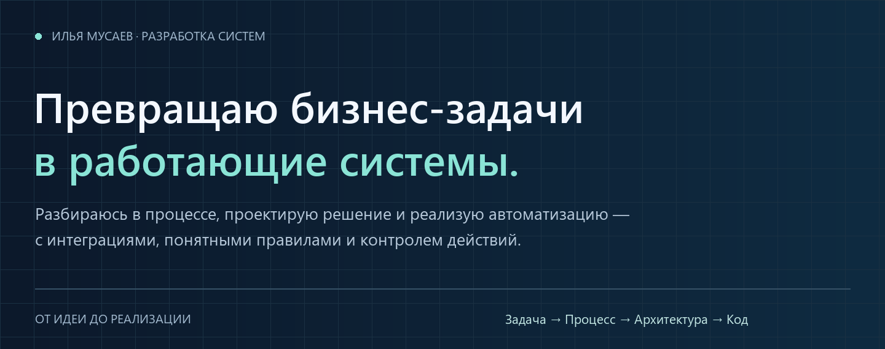
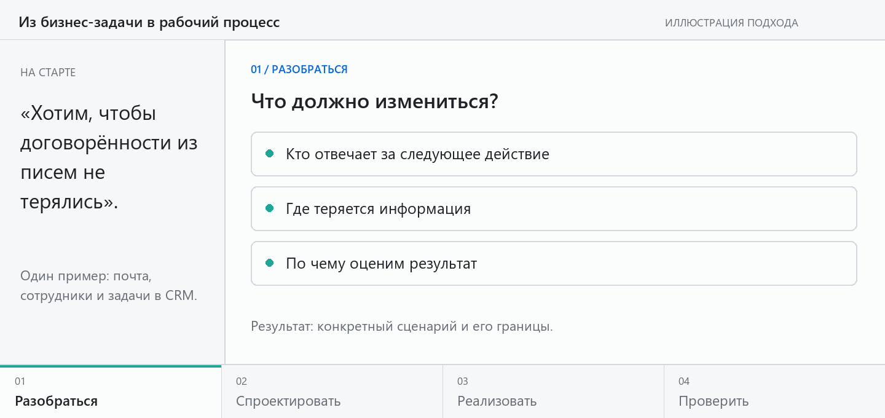

Ко мне можно прийти с задачей, которую ещё предстоит сформулировать. Разберёмся, как всё устроено сейчас и что должна делать система.

**[Обсудить задачу ↗](https://t.me/mia_ops)** · [Как работаю ↓](#approach)

## Есть задача. Нужен путь к решению.

| «Хотим автоматизировать» | «Всё переносим руками» | «Как применить AI?» |
| :--- | :--- | :--- |
| Идея есть, но требования и устройство будущей системы ещё нужно определить. | Информация разбросана по сервисам. Сотрудники связывают их своими усилиями. | Нужно выбрать полезную роль модели и определить, какие решения остаются за человеком. |

## От «хотим проще» — к понятной системе.

[Посмотреть схему без анимации](assets/work-process-still.png)

## Понятно устроено. Управляемо работает.

| Границы автоматизации | Поведение при ошибках |
| :--- | :--- |
| Какие данные доступны системе, что она может сделать и где необходимо решение человека. | Что произойдёт при повторе, нехватке данных или отказе сервиса. Эти ситуации входят в проектирование. |

**Средства реализации:** Python · AI / LLM · API · Интеграции · Тестирование.

Код на GitHub: <a href="https://github.com/Bakunin-dev/mail-agent-runtime">Mail Agent</a> · <a href="https://github.com/Bakunin-dev/SumAI">SumAI</a>

